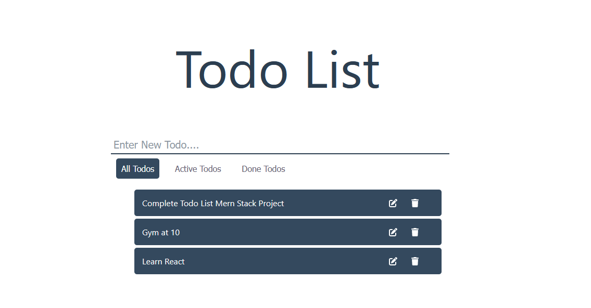
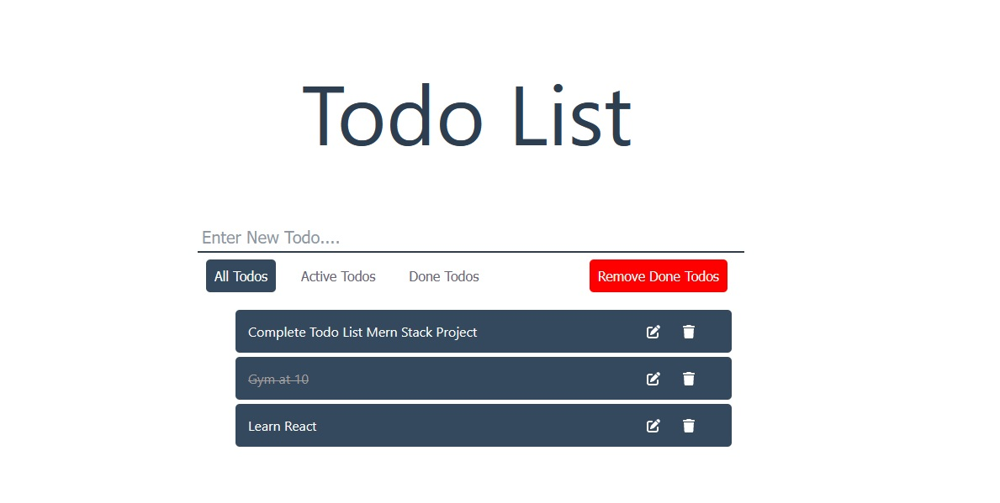
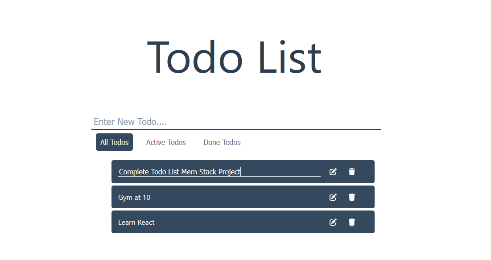

## MERN Stack Todo App
A simple Todo list using the MERN stack has CRUD functionality.

### Features:
- Add Todo - The user can add todos by adding tasks in the input field and pressing enter.
- Edit Todo - The user can edit todos by clicking on the pen icon, editing the task, and clicking enter.
- Toggle Todo - The user can toggle todos by clicking on the task.
- Delete Todo - The user can delete todos by clicking on the trash icon.

### There are four tabs:
- All Todos - Shows all the tasks.
- Active Todo - Shows the undone tasks.
- Done Todo - Shows the done tasks.
- Remove Done Todos - Delete all completed tasks. It appears only when some tasks are toggled or done.

## Backend 
- The backend part is in the server file.
- The server API is built on NodeJS and MongoDB.
- The server API is deployed on Render.

### Libraries Used:
- cors
- dotenv
- express
- mongoose
- nodemon

## Frontend
- The frontend part is in the client file.
- The client side is built on React, Redux.
- The frontend is deployed on Netlify .

### Libraries Used:
- axios
- react-redux
- redux
- redux-thunk
- @fortawesome/fontawesome-svg-core
- @fortawesome/free-regular-svg-icons
- @fortawesome/free-solid-svg-icons
- @fortawesome/react-fontawesome
